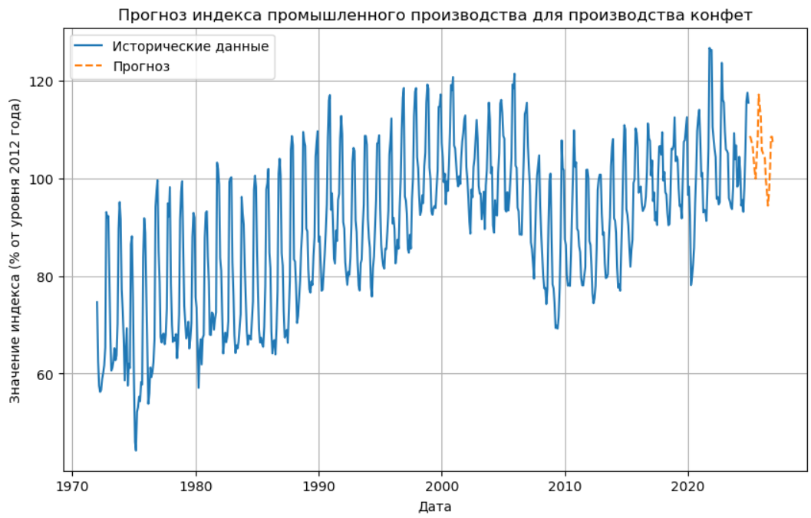
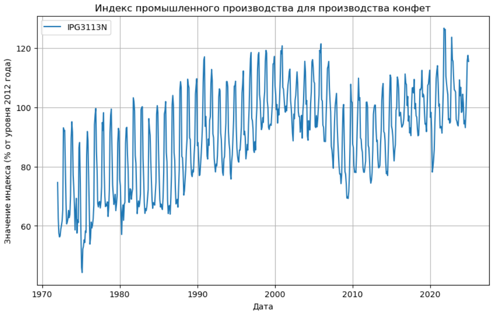

# Прогнозирование индекса промышленного производства для производства конфет

## Задание
Необходимо спрогнозировать индустриальный продуктовый индекс (IPG3113N) для производства конфет в США на 24 месяца вперед.  
Использовались исторические данные с января 1972 года по настоящий момент.

## Выполненные шаги
1. Исследованы и визуализированы исторические данные.
2. Выполнена предварительная обработка: нормализация данных и создание обучающей выборки.
3. Построена модель регрессии на основе нейронной сети.
4. Проведен подбор гиперпараметров для улучшения качества модели.
5. Спрогнозированы значения индекса на 24 месяца вперед.

## Результаты
### Исторические данные

### Прогноз

